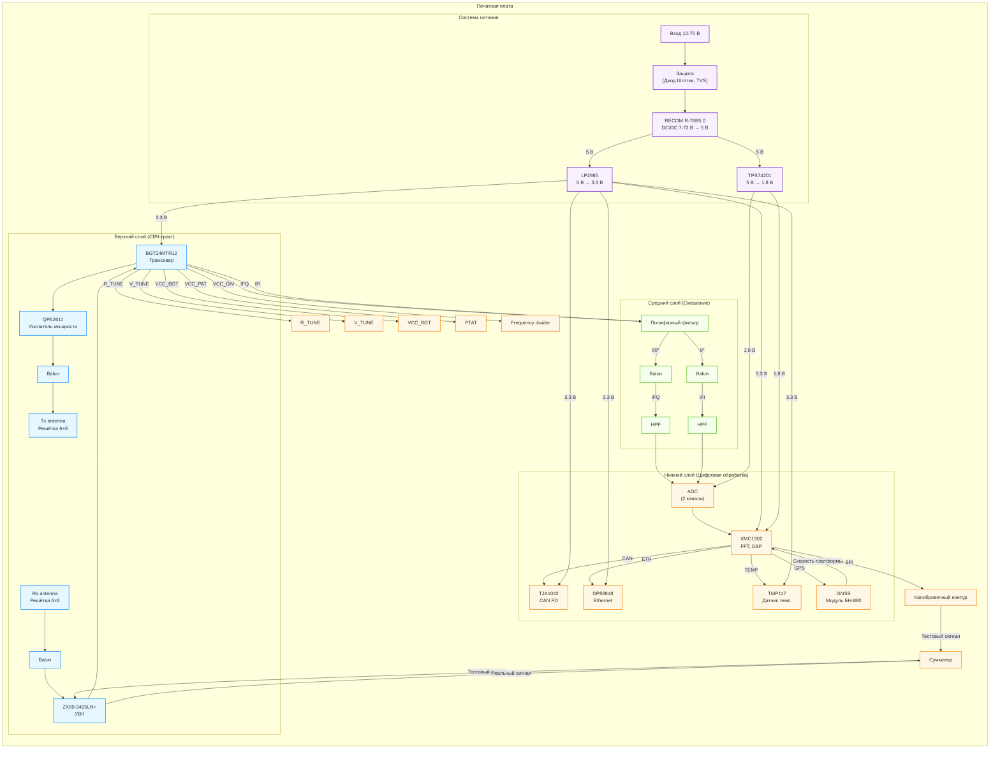

# Структурная схема ДИНС

```mermaid
flowchart LR
    %% Топология платы (сверху вниз)
    subgraph "Печатная плата"
        direction TB
        
        %% Верхний слой (СВЧ-компоненты)
        subgraph "Верхний слой (СВЧ-тракт)"
            direction LR
            ANT_RX["Rx antenna\nРешётка 6×6"] --> BALUN2["Balun"]
            BALUN2 --> LNA["ZX60-2425LN+\nУВЧ"]
            LNA --> BGT["BGT24MTR12\nТрансивер"]
            BGT --> PA["QPA2611\nУсилитель мощности"]
            PA --> BALUN1["Balun"]
            BALUN1 --> ANT_TX["Tx antenna\nРешётка 6×6"]
        end

        %% Средний слой (Смешение и фильтрация)
        subgraph "Средний слой (Смешение)"
            direction LR
            BGT -->|IFQ| POLY["Полифазный фильтр"]
            BGT -->|IFI| POLY
            POLY -->|90°| BALUN3["Balun"]
            POLY -->|0°| BALUN4["Balun"]
            BALUN3 -->|IFQ| HPF1["HPF"]
            BALUN4 -->|IFI| HPF2["HPF"]
        end

        %% Нижний слой (Цифровая обработка)
        subgraph "Нижний слой (Цифровая обработка)"
            direction LR
            HPF1 --> ADC["ADC\n(2 канала)"]
            HPF2 --> ADC
            ADC --> MCU["XMC1302\nFFT, DSP"]
            MCU -->|CAN| CAN["TJA1042\nCAN FD"]
            MCU -->|ETH| ETH["DP83848\nEthernet"]
            MCU -->|TEMP| TEMP["TMP117\nДатчик темп."]
            MCU -->|GPS| GPS["GNSS\nМодуль БН-880"]
        end

        %% Система питания
        subgraph "Система питания"
            direction TB
            PWR["Вход 10-70 В"] --> PROTECT["Защита\n(Диод Шоттки, TVS)"]
            PROTECT --> DC_DC["RECOM R-78B5.0\nDC/DC 7-72 В → 5 В"]
            DC_DC -->|5 В| LDO3_3["LP2985\n5 В → 3.3 В"]
            DC_DC -->|5 В| LDO1_8["TPS74201\n5 В → 1.8 В"]
            LDO3_3 -->|3.3 В| BGT
            LDO3_3 -->|3.3 В| MCU
            LDO3_3 -->|3.3 В| CAN
            LDO3_3 -->|3.3 В| ETH
            LDO3_3 -->|3.3 В| TEMP
            LDO1_8 -->|1.8 В| ADC
            LDO1_8 -->|1.8 В| MCU
        end

        %% Соединения между слоями
        BGT -->|R_TUNE| TUNE["R_TUNE"]
        BGT -->|V_TUNE| VTUNE["V_TUNE"]
        BGT -->|VCC_BGT| VCC_BGT["VCC_BGT"]
        BGT -->|VCC_PAT| PAT["PTAT"]
        BGT -->|VCC_DIV| F_DIV["Frequency divider"]
        GPS -->|Скорость платформы| MCU

        %% Калибровочный контур (с двумя сигналами в сумматор)
        MCU -->|SPI| CAL["Калибровочный контур"]
        CAL -->|Тестовый сигнал| SUM["Сумматор"]
        SUM -->|Тестовый сигнал| LNA
        LNA -->|Реальный сигнал| SUM
    end

    %% Сигнальные линии
    classDef layer1 fill:#e6f7ff,stroke:#1890ff,stroke-width:1.5px;
    classDef layer2 fill:#f6ffed,stroke:#52c41a,stroke-width:1.5px;
    classDef layer3 fill:#fff7e6,stroke:#fa8c16,stroke-width:1.5px;
    classDef power fill:#f9f0ff,stroke:#722ed3,stroke-width:1.5px;
    classDef component fill:#e6f7ff,stroke:#1890ff,stroke-width:1.5px;
    
    class ANT_RX,BALUN2,LNA,BGT,PA,BALUN1,ANT_TX layer1
    class POLY,BALUN3,BALUN4,HPF1,HPF2 layer2
    class ADC,MCU,CAN,ETH,TEMP,GPS,TUNE,VTUNE,VCC_BGT,PAT,F_DIV,CAL,SUM layer3
    class PWR,PROTECT,DC_DC,LDO3_3,LDO1_8 power
    class XMC1302,BGT24MTR12,ZX60-2425LN+,QPA2611 component
```
