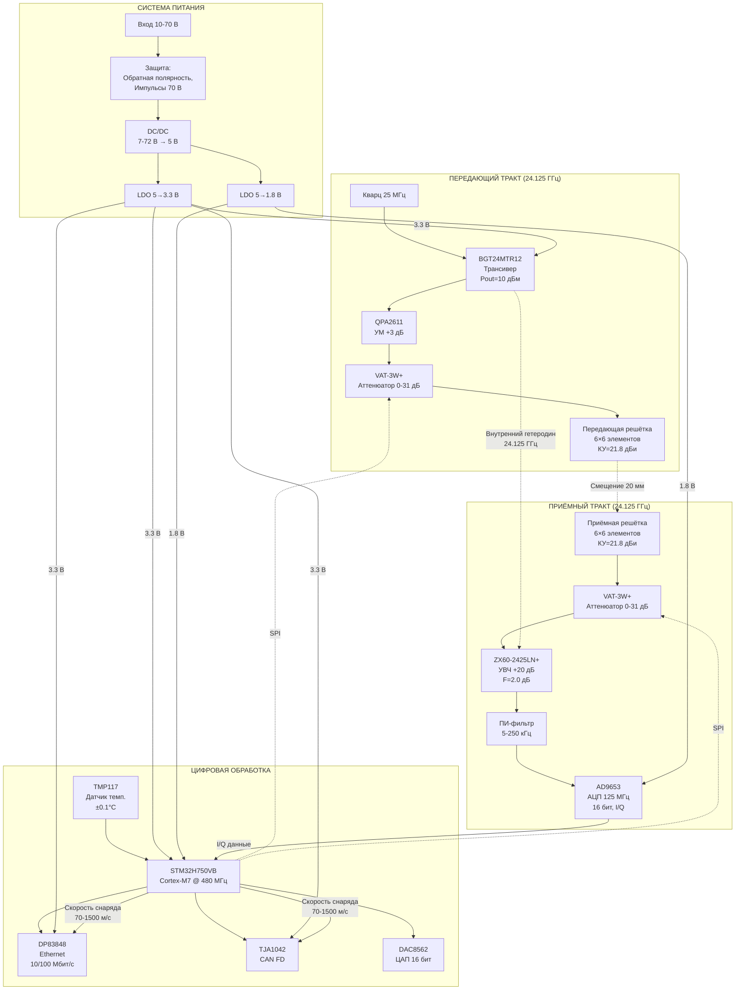

# Структурная схема ДИНС

```mermaid
flowchart TD
    subgraph POWER["СИСТЕМА ПИТАНИЯ"]
        direction LR
        P1["Вход 10-70 В"] --> P2["Защита:\nОбратная полярность,\nИмпульсы 70 В"]
        P2 --> P3["DC/DC\n7-72 В → 5 В"]
        P3 --> P4["LDO 5→3.3 В"]
        P3 --> P5["LDO 5→1.8 В"]
    end

    subgraph RF_TX["ПЕРЕДАЮЩИЙ ТРАКТ (24.125 ГГц)"]
        direction LR
        XTAL["Кварц 25 МГц"] --> BGT["BGT24MTR12\nТрансивер\nPout=10 дБм"]
        BGT --> QPA["QPA2611\nУМ +3 дБ"]
        QPA --> ATT_TX["VAT-3W+\nАттенюатор 0-31 дБ"]
        ATT_TX --> ANT_TX["Передающая решётка\n6×6 элементов\nКУ=21.8 дБи"]
    end

    subgraph RF_RX["ПРИЁМНЫЙ ТРАКТ (24.125 ГГц)"]
        direction LR
        ANT_RX["Приёмная решётка\n6×6 элементов\nКУ=21.8 дБи"] --> ATT_RX["VAT-3W+\nАттенюатор 0-31 дБ"]
        ATT_RX --> LNA["ZX60-2425LN+\nУВЧ +20 дБ\nF=2.0 дБ"]
        LNA --> LPF["ПИ-фильтр\n5-250 кГц"]
        LPF --> ADC["AD9653\nАЦП 125 МГц\n16 бит, I/Q"]
    end

    subgraph DIGITAL["ЦИФРОВАЯ ОБРАБОТКА"]
        direction LR
        MCU["STM32H750VB\nCortex-M7 @ 480 МГц"] --> ETH["DP83848\nEthernet\n10/100 Мбит/с"]
        MCU --> CAN["TJA1042\nCAN FD"]
        MCU --> DAC["DAC8562\nЦАП 16 бит"]
        TEMP["TMP117\nДатчик темп.\n±0.1°C"] --> MCU
    end

    %% Связи между подграфами
    P4 -->|3.3 В| BGT
    P4 -->|3.3 В| MCU
    P4 -->|3.3 В| ETH
    P4 -->|3.3 В| CAN
    P5 -->|1.8 В| ADC
    P5 -->|1.8 В| MCU
    
    %% Гетеродин (внутренний для BGT24MTR12)
    BGT -.->|Внутренний гетеродин\n24.125 ГГц| LNA
    
    %% Управление аттенюаторами
    MCU -.->|SPI| ATT_TX
    MCU -.->|SPI| ATT_RX
    
    %% Цифровая обработка
    ADC -->|I/Q данные| MCU
    
    %% Выходные данные
    MCU -->|Скорость снаряда\n70-1500 м/с| ETH
    MCU -->|Скорость снаряда\n70-1500 м/с| CAN
    
    %% Антенная система (пространственное разнесение)
    ANT_TX -.->|Смещение 20 мм| ANT_RX
```
